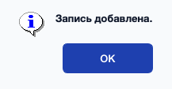
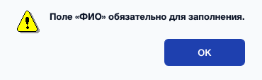
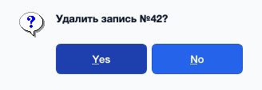
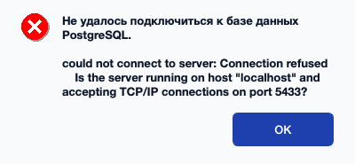

# ПРИЛОЖЕНИЕ Б — Руководство пользователя

## Б.1 Назначение и условия применения

АИС ОУДО — настольное приложение для работы с базой данных учебного
учреждения дистанционного обучения. Предназначено для трёх категорий
пользователей: сотрудников учебной части (роль *administrator*),
преподавателей (роль *teacher*), студентов (роль *student*).

## Б.2 Подготовка к работе

### Б.2.1 Требования к рабочей станции

См. Приложение А, п. А.2.4.

### Б.2.2 Установка приложения

1. Установить Python 3.10+. На macOS: `brew install python@3.12`.
2. Установить PostgreSQL 13+: `brew install postgresql@17` (macOS),
   `apt install postgresql` (Debian/Ubuntu).
3. Создать базу: `createdb ac_oudo`.
4. Применить SQL-скрипты:
   ```sh
   psql -d ac_oudo -f sql/01_schema.sql
   psql -d ac_oudo -f sql/02_indexes.sql
   psql -d ac_oudo -f sql/03_views.sql
   psql -d ac_oudo -f sql/04_seed.sql
   ```
5. Установить Python-зависимости:
   ```sh
   python -m venv .venv
   source .venv/bin/activate
   pip install -r requirements.txt
   ```
6. Скопировать `.env.example` в `.env` и при необходимости подкорректировать
   параметры подключения (хост, пользователь, пароль).

### Б.2.3 Запуск приложения

```sh
python -m app.main
```

После запуска появится окно «АС ОУДО — Авторизация».

## Б.3 Работа с программой

### Б.3.1 Авторизация

1. Введите логин в поле «Логин».
2. Введите пароль (символы скрываются точками).
3. Нажмите «Войти» либо клавишу `Enter`.
4. При вводе неверных данных появится сообщение об ошибке; введите
   данные заново.

Для демонстрации в БД заведены учётные записи:

| Логин      | Пароль     | Роль          |
|------------|------------|---------------|
| `admin`    | `admin`    | администратор |
| `teacher1` | `teacher1` | преподаватель |
| `student1` | `student1` | студент       |

(см. полный список в `README.md`)

### Б.3.2 Работа в роли сотрудника

#### Б.3.2.1 Управление справочниками

1. В главном меню нажмите кнопку нужной сущности (например, «Студенты»).
2. Откроется форма со списком и панелью ввода. Для добавления записи
   заполните поля справа и нажмите «Добавить». Для редактирования —
   выделите строку в таблице, измените нужные поля и нажмите «Изменить».
   Для удаления — выделите строку, нажмите «Удалить» и подтвердите
   действие.
3. Для поиска введите подстроку в поле «Поиск по таблице…» и нажмите
   `Enter` или кнопку «Найти». Для возврата к полному списку нажмите
   «Сброс».
4. Кнопка «Печать» открывает предпросмотр печати: можно отправить отчёт
   на принтер или сохранить в PDF.
5. Кнопка «Назад» закрывает форму и возвращает в главное меню.

#### Б.3.2.2 Создание учётной записи

При добавлении студента/преподавателя/сотрудника одновременно создаётся
запись в таблице `users`: укажите поля «Логин» и «Пароль». При
редактировании эти поля заблокированы — учётная запись не меняется.

#### Б.3.2.3 Регистрация договора

1. Откройте форму «Договоры».
2. Выберите тип договора — «Об обучении» или «Трудовой». Поле «Студент»
   доступно только для договоров об обучении, «Преподаватель» — только
   для трудовых.
3. Выберите сотрудника, контрагента, дату договора и нажмите «Добавить».

#### Б.3.2.4 Просмотр отчётов

В нижней части меню сотрудника три кнопки отчётов («Курсы», «Запись»,
«Преподаватели»). Каждая открывает табличное окно. Кнопка «Обновить»
перечитывает данные из БД, «Печать» — открывает предпросмотр печати.

### Б.3.3 Работа в роли преподавателя

#### Б.3.3.1 Ведение заданий

В меню преподавателя нажмите «Задания». Заполните поля «Название», «Курс»,
«Тип» (домашнее, лабораторная, тест и т. д.), «Срок», «Макс. балл» и
нажмите «Добавить». Поле «Описание» необязательно.

#### Б.3.3.2 Ведение вариантов

Для каждого задания можно создать несколько вариантов. В форме «Варианты»
выберите задание, укажите номер и текст варианта.

#### Б.3.3.3 Выставление оценок

В форме «Оценки» выберите студента и задание, укажите балл (0–100), дату
выставления. Балл валидируется на стороне БД через CHECK-ограничение.

#### Б.3.3.4 Аналитика

Преподавателю доступны три отчёта: «Средний балл», «100-балльная
система», «Баллы студента».

### Б.3.4 Работа в роли студента

В меню студента доступны три отчёта в режиме «только чтение»:
«Мои курсы», «Мои оценки», «100-балльная система». Каждый отчёт
автоматически фильтруется по идентификатору вошедшего студента —
посторонние данные не отображаются.

## Б.4 Завершение работы

- Кнопка **«Выйти из аккаунта»** в любом меню возвращает в окно
  авторизации со сбросом сессии.
- Кнопка **«Выйти из приложения»** закрывает все окна и завершает
  процесс.

## Б.5 Сообщения об ошибках и исключительные ситуации

| Ситуация | Сообщение | Действие пользователя |
|----------|-----------|------------------------|
| Неверные логин или пароль | `QMessageBox.critical` «Неверный логин или пароль» | Повторить ввод |
| Пустые обязательные поля | `QMessageBox.warning` «Поле … обязательно» | Заполнить поле |
| Дата окончания ≤ даты начала | `QMessageBox.warning` «Дата окончания должна быть позже даты начала» | Изменить даты |
| Нарушение FK или CHECK на уровне СУБД | `QMessageBox.critical` с текстом ошибки PostgreSQL | Проверить значения, исправить связанные записи |
| Не запущен сервер PostgreSQL | `QMessageBox.critical` «Не удалось подключиться к базе данных PostgreSQL» | Запустить сервер `brew services start postgresql@17` |
| Удаление справочной записи, на которую есть ссылки | Сообщение «update or delete on table … violates foreign key constraint» | Удалить или перенаправить зависимые записи |

Типовые экраны системных сообщений приведены ниже.

{ width=12cm }

*Рисунок Б.1 — Сообщение об успешном добавлении записи
(`QMessageBox.information`).*

{ width=12cm }

*Рисунок Б.2 — Сообщение о нарушении валидации обязательных полей
(`QMessageBox.warning`).*

{ width=12cm }

*Рисунок Б.3 — Сообщение-подтверждение удаления записи
(`QMessageBox.question`).*

{ width=12cm }

*Рисунок Б.4 — Сообщение об ошибке подключения к серверу PostgreSQL
(`QMessageBox.critical`).*
