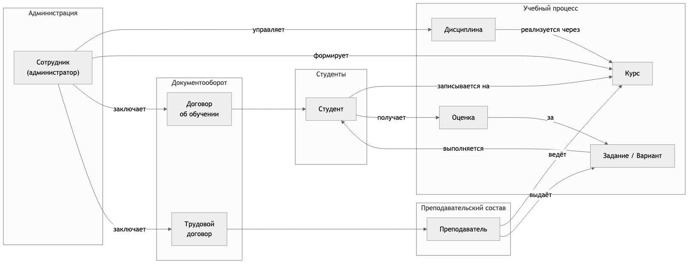
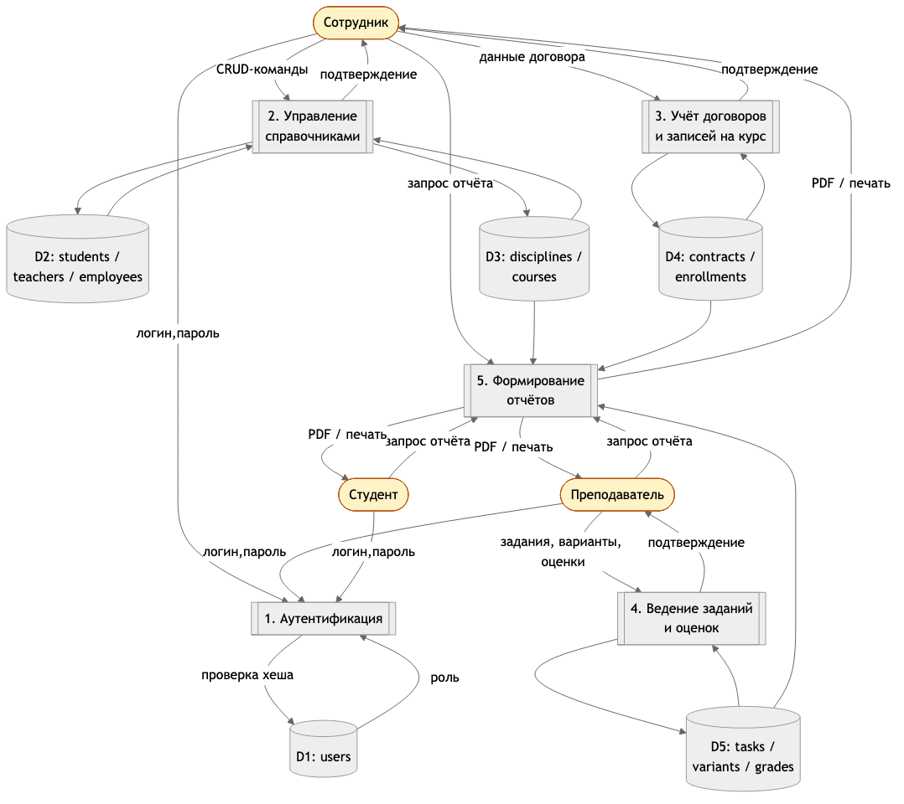
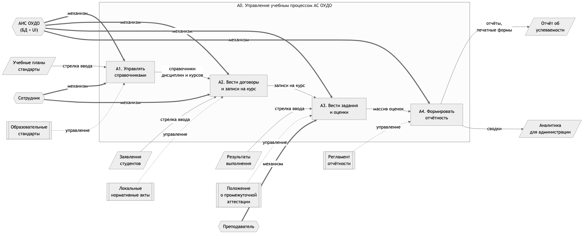
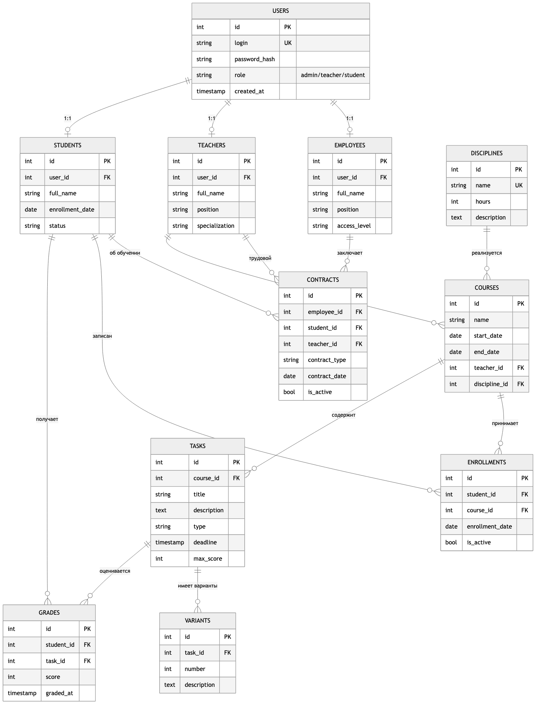
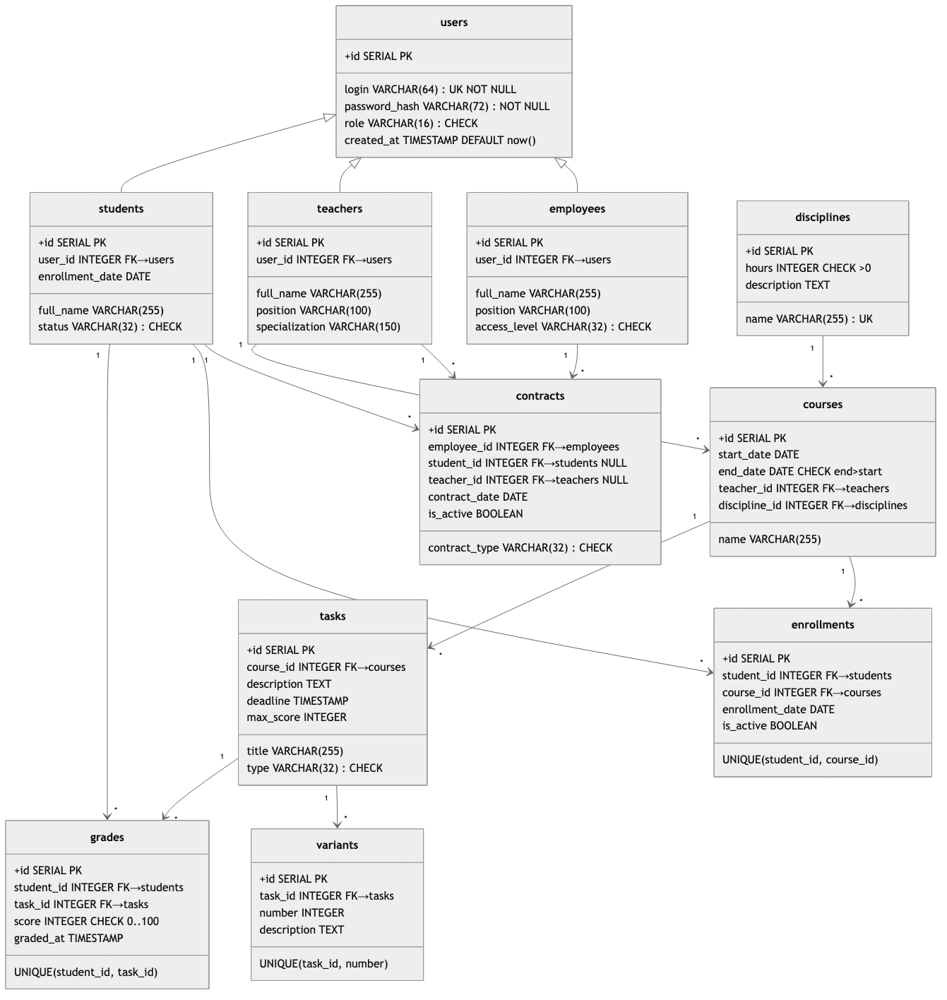
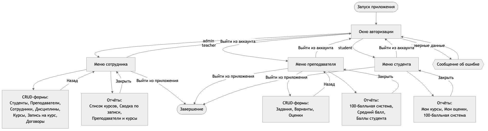
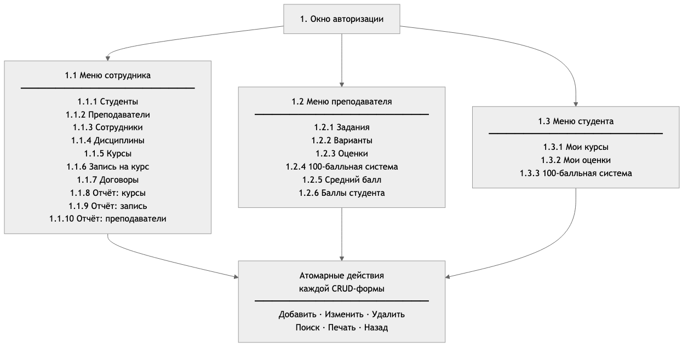
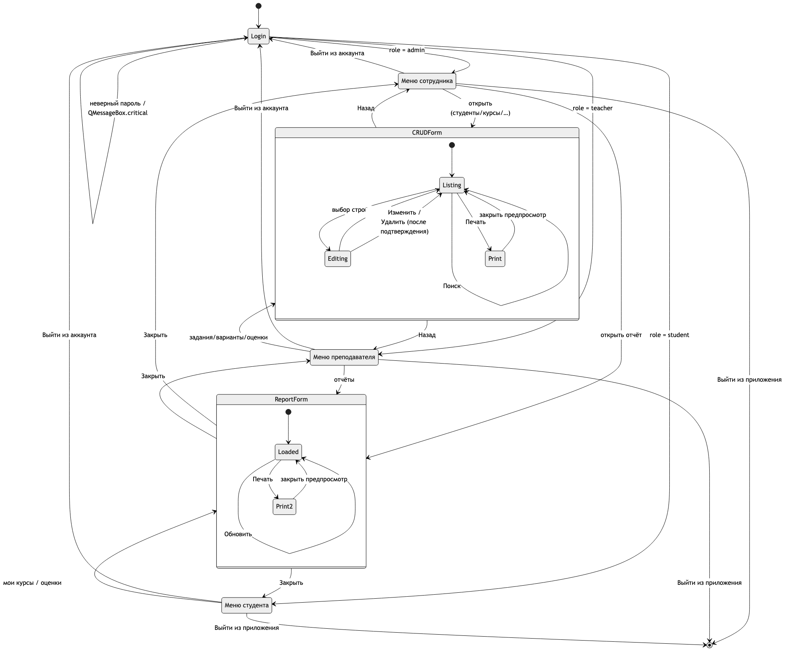

# ПРИЛОЖЕНИЕ Г — Графическая часть

Графическая часть содержит восемь листов формата А4/А3. Исходники
выполнены в нотации Mermaid и хранятся в каталоге `docs/graphics/`,
PNG-версии собираются командой `make mermaid` или конвертацией через
`@mermaid-js/mermaid-cli`.

## Лист 1. Изображение предметной области

{ width=16cm }

*Рисунок Г.1 — Изображение предметной области.* Пять предметных областей
АС ОУДО (администрация, преподавательский состав, студенты, учебный
процесс, документооборот) и связи между ними.

## Лист 2. Диаграмма потоков данных DFD

{ width=16cm }

*Рисунок Г.2 — Диаграмма потоков данных.* Три внешние сущности,
пять процессов первого уровня (аутентификация, управление справочниками,
учёт договоров, ведение оценок, формирование отчётов), пять групп
хранилищ.

## Лист 3. Функциональная модель IDEF0

{ width=16cm }

*Рисунок Г.3 — Функциональная модель IDEF0.* Контекстная диаграмма A-0
и декомпозиция A0 на четыре блока: A1 — управление справочниками,
A2 — ведение договоров, A3 — ведение оценок, A4 — формирование
отчётности. На стрелках указаны четыре класса связей IDEF0:
вход (I), управление (C), механизм (M), выход (O).

## Лист 4. Инфологическая (ER) модель

{ width=16cm }

*Рисунок Г.4 — Инфологическая модель.* 11 сущностей (USERS, EMPLOYEES,
TEACHERS, STUDENTS, DISCIPLINES, COURSES, ENROLLMENTS, CONTRACTS,
TASKS, VARIANTS, GRADES) с указанием атрибутов и связей.

## Лист 5. Датологическая модель

{ width=16cm }

*Рисунок Г.5 — Датологическая модель.* Для каждой из 11 таблиц приведены
имя, состав полей, типы данных PostgreSQL, обозначение первичного ключа
(`+id PK`), внешних ключей (стрелки), ограничений UNIQUE, CHECK и
значений по умолчанию.

## Лист 6. Схема работы системы

{ width=16cm }

*Рисунок Г.6 — Схема работы системы.* Блок-схема с входной точкой
«Запуск приложения», ветвлением по ролям и набором конечных состояний.

## Лист 7. Структурная схема системы

{ width=16cm }

*Рисунок Г.7 — Структурная схема.* Дерево пунктов меню по трём ролям
с разверткой для CRUD-форм администратора (атомарные действия Добавить /
Изменить / Удалить / Поиск / Печать / Назад).

## Лист 8. Граф диалога

{ width=16cm }

*Рисунок Г.8 — Граф диалога.* Все возможные переходы между формами
с указанием условий: успешная аутентификация, выбор записи, нажатие
кнопок «Изменить»/«Удалить»/«Назад»/«Выйти из аккаунта».
